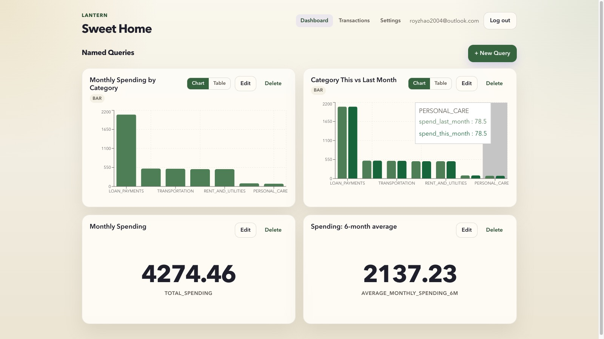

# Lantern

<p align="center">
  
</p>

<p align="center">
  <a href="https://lantern-public.royzhao.dev/"><strong>Open the live public app</strong></a>
  <br />
  Public entrypoint: <a href="https://lantern-public.royzhao.dev/">https://lantern-public.royzhao.dev/</a>
</p>

<p align="center">
  <a href="https://lantern-public.royzhao.dev/">
    
  </a>
  
  
  
</p>

Lantern is a household finance app for shared financial visibility. It lets a household link bank accounts, inspect transactions together, and save reusable SQL-backed views over that data instead of treating personal finance as a pile of disconnected account screens.

The repo contains the full product surface: React frontend, FastAPI backend, background sync worker, deployment material, and architecture decisions. The public environment is intended as the main entrypoint for exploring the project.

## What the public app shows

- Live authentication and household setup flows.
- Shared household transaction visibility across linked accounts.
- Plaid Sandbox institution linking in the public environment.
- A transaction ledger for browsing synced financial activity.
- Named Queries: saved SQL-backed charts and tables over household data.
- AI-assisted drafting for Named Queries, with validation and preview before saving.

## Public entrypoint

Use the live public app here:

```text
https://lantern-public.royzhao.dev/
```

That public environment emphasizes the real product flow while keeping external financial connectivity safe through Plaid Sandbox.

## Architecture

| Layer | Technology |
| --- | --- |
| Frontend | React, TypeScript, Vite |
| Backend | FastAPI, SQLAlchemy, Alembic |
| Data | PostgreSQL |
| Bank connectivity | Plaid |
| Auth | Firebase |
| Async work | Background sync worker |
| Ops | Docker Compose, deployment and observability docs under `ops/` |

Lantern is organized around a **household** as the access-control boundary. Members of the same household can see the same linked financial data, and the main product payoff is reusable analysis over that shared transaction history.

## Repository

```text
.
|-- backend/          # FastAPI app, Alembic migrations, worker, pytest suite
|-- frontend/         # React + TypeScript app built with Vite
|-- docs/adr/         # Architecture Decision Records
|-- ops/              # Deployment and observability configuration
|-- docker-compose.yml
`-- README.md
```

## Local development

### Prerequisites

- Docker and Docker Compose for the full stack.
- Python 3 for backend development.
- Node.js and npm for frontend development.
- A populated `backend/.env` file for local backend secrets.
- `ngrok` or another HTTPS tunnel if you need to test Plaid webhooks locally.

### Run the full stack

From the repo root:

```sh
docker compose up --build
```

This starts:

- Postgres on `localhost:5432`
- Backend API on `http://localhost:8000`
- Backend worker
- Frontend on `http://localhost:3000`

### Run services directly

Backend:

```sh
cd backend
python3 -m venv .venv
source .venv/bin/activate
pip install -r requirements.txt
uvicorn src.server:app --reload --host 0.0.0.0 --port 8000
```

Worker:

```sh
cd backend
source .venv/bin/activate
python -m src.transactions_sync_runner
```

Frontend:

```sh
cd frontend
npm install
npm start
```

## Environment notes

- Keep secrets in `backend/.env` only.
- Do not expose backend credentials in the frontend.
- When working with generated frontend API types, start the backend first and then run `npm run generate-api-types` from `frontend/` against `http://localhost:8000/openapi.json`.
- The local backend also expects Firebase admin credentials and Plaid-related configuration in `backend/.env`.

## Testing

Backend:

```sh
cd backend
pytest
```

Frontend:

```sh
cd frontend
npm test
npm run typecheck
npm run build
```

## Design and operations docs

- Architecture decisions live in `docs/adr/`.
- Deployment material lives under `ops/deployment/`.
- Observability material lives under `ops/observability/`.

If you are evaluating the project, start with the live public app at `https://lantern-public.royzhao.dev/`, then use the ADRs and ops docs to inspect the technical decisions behind it.
